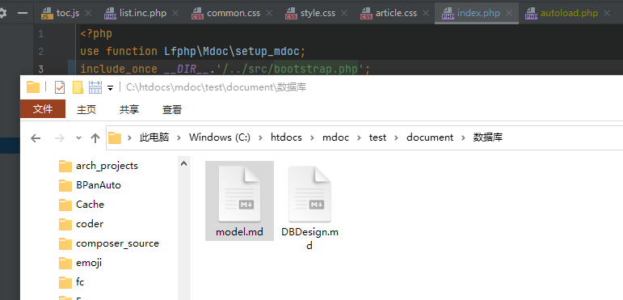
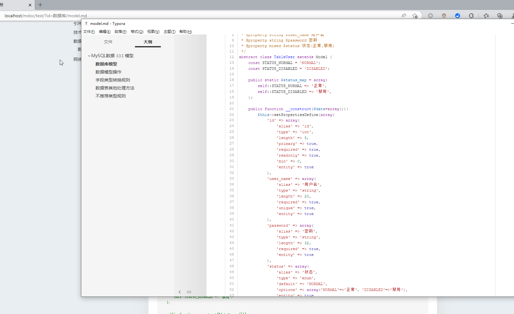

# MySQL数据 ``333`` 模型

[TOC]

## 数据库模型
LitePHP DB Model类包含两块定义：数据表定义类(Table)、业务模型类(Model)，其中数据库表定义类不推荐通过人工方式维护，尽量保证与
实际数据库表一致，方便监控数据表版本流程。



一个简单的Table定义如下：
``` php
<?php
namespace HelloWorld\table;
use Lite\DB\Model as Model;

/**
 * Class TableUser
 * @property-read int $id 
 * @property string $user_name 用户名
 * @property string $password 密码
 * @property mixed $status 状态(正常,禁用)
 */
abstract class TableUser extends Model {
	const STATUS_NORMAL = 'NORMAL';
	const STATUS_DISABLED = 'DISABLED';

	public static $status_map = array(
		self::STATUS_NORMAL => '正常',
		self::STATUS_DISABLED => '禁用',
	);

	public function __construct($data=array()){
		$this->setPropertiesDefine(array(
			'id' => array(
				'alias' => 'id',
				'type' => 'int',
				'length' => 5,
				'primary' => true,
				'required' => true,
				'readonly' => true,
				'min' => 0,
				'entity' => true
			),
			'user_name' => array(
				'alias' => '用户名',
				'type' => 'string',
				'length' => 20,
				'required' => true,
				'unique' => true,
				'entity' => true
			),
			'password' => array(
				'alias' => '密码',
				'type' => 'string',
				'length' => 32,
				'required' => true,
				'entity' => true
			),
			'status' => array(
				'alias' => '状态',
				'type' => 'enum',
				'default' => 'NORMAL',
				'options' => array('NORMAL'=>'正常', 'DISABLED'=>'禁用'),
				'entity' => true
			),
		));
		parent::__construct($data);
	}

	/**
	 * current model table name
	 * @return string
	 */
	public function getTableName() {
		return 'user';
	}

	/**
	* get database config
	* @return array
	*/
	protected function getDbConfig(){
		return include dirname(__DIR__).'/db.inc.php';
	}

	/**
	* 获取模块名称
	* @return string
	*/
	public function getModelDesc(){
		return '用户';
	}
}
```

简单的Model定义如下：
``` php
<?php
namespace HelloWorld\model;
use HelloWorld\table\TableUser;

/**
 * User: Lite Scaffold
 * @property \HelloWorld\model\Role $role
 */
class User extends TableUser {
	/**
	 * 是否为正常用户
	 * @param $clear_key
	 * @return bool
	 */
	public function isNormal(){
		return $this->status == self::STATUS_NORMAL;
	}
}
```

一般项目中，PHP项目应对的数据模型为数据表模型时，数据表模型将进行以下规则转换，以及其他的一些处理。



## 数据模型操作
``` php
<?php
//查找单个用户
$user = User::find('id=?',1)->one();

//调用User方法
var_dump($user->isNormal());

//查找单个客户（检测异常）
$user = User::find('id=?', 1)->oneOrFail();

//批量查找用户 - 全量
$user_list = User::find('status="Normal"')->all();

//批量查找用户 - 指定页码
$user_list = User::find('status="Normal"')->paginate(1);

//批量查找用户 - 分页器
$paginate = Paginate::instance();
$user_list = User::find('status="Normal"')->paginage($paginate);
```

## 字段类型转换规则

框架针对数据表模型制定以下类型转换规则。

MySQL字段类型转换规则：
<table class="rule">
	<thead>
		<tr><th width="10%">类别</th><th>字段类型</th><th>目标类型（Selector）</th><th width="40%">补充</th></tr>
	</thead>
	<tbody>
		<tr>
			<th rowspan="2">数字</th>
			<td>tinyint，smallint，mediumint，int，bigint</td>
			<td>input:number</td>
			<td>
				1. 如果define里面没有额外声明options才会被转换成input:number，否则将以Set类型进行转换。<br/>
				2. 如果定义UNSIGNED,会产生 min=0
			</td>
		</tr>
		<tr>
			<td>decimal，float，double</td>
			<td>input:number</td>
			<td>
				1. 根据小数点精度产生相应的 step精度控制,如step=0.01<br/>
				2. 如果定义UNSIGNED,会产生 min=0
			</td>
		</tr>
		<tr>
			<th rowspan="4">日期</th>
			<td>year</td>
			<td>input:year</td>
			<td></td>
		</tr>
		<tr>
			<td>datetime，timestamp</td>
			<td>input:local-datetime</td>
			<td></td>
		</tr>
		<tr>
			<td>date</td>
			<td>input:local-date</td>
			<td></td>
		</tr>
		<tr>
			<td>time</td>
			<td>input:text</td>
			<td></td>
		</tr>
		<tr>
			<th rowspan="5">字符</th>
			<td>char，varchar</td>
			<td>input:text</td>
			<td></td>
		</tr>
		<tr>
			<td>tinytext</td>
			<td>textarea</td>
			<td></td>
		</tr>
		<tr>
			<td>text</td>
			<td>产生简单富文本编辑器<sup>1</sup></td>
			<td></td>
		</tr>
		<tr>
			<td>mediumtext</td>
			<td>产生复杂富文本编辑器<sup>1</sup></td>
			<td></td>
		</tr>
		<tr>
			<td>longtext</td>
			<td>产生复杂富文本编辑器<sup>1</sup></td>
			<td></td>
		</tr>
		<tr>
			<th>枚举</th>
			<td>enum</td>
			<td>产生 `select` 或 `input:radio`</td>
			<td>备注内包含格式(a,b,c) 被作为对应的(按照下标排序)选项名称</td>
		</tr>
		<tr>
			<th>集合</th>
			<td>set</td>
			<td>input:checkbox</td>
			<td>
				1. 产生 `input:checkbox` <br/>
            	2. 备注内包含格式(a,b,c) 被作为对应的(按照下标排序)选项名称
			</td>
		</tr>
	</tbody>
</table>

注[1]：富文本编辑器需在自定义View视图处理器中接入自定义富文本Javascript组件。

## 数据表其他处理方法
* 数据表comment缺省被解析为模型(model)名称
* 字段comment缺省被解析为alias(字段名称)
* 未设置default=NULL的字段将被定义为required，表单元素追加required="required"属性
* 备注内包含括号部分,如:(note)，将被解析为字段补充描述(description),追加在输入表单后面,enum,set除外
* default在不为null情况下,值将被填入默认表单值(新建页面)
* primary key缺省为readonly，不产生表单元素

## 不推荐类型规则
	1. 声明timestamp类型，实际存储却为int类型

[MySQL数据库规范](DBDesign.md)
